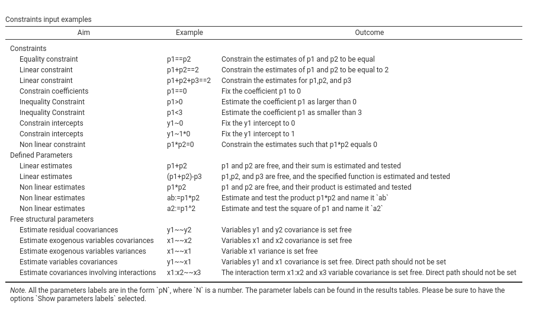

```{r echo=FALSE,results='hide'}
source("../R/constants.R")
source("../R/functions.R")
```

`r keywords("pathj,jamovi, path analyis")`

**PATHJ** module of the PATHj suite for jamovi

`r version("0.2.*")` 
`r draft`


# Introduction

The `r modulename` module is a `r jamovi` interface to `lavaan` R package [@lavaan]. It implements path analysis, so SEM models with observed variables (no latent variables). The module handles continuous dependent (endogenous) variables, continuous and categorical independent (exogenous) variables, linear and interaction effects. Path diagrams are available thanks to R package `semPlot` [@semplot]. Please refer to these packages help for details about models estimation, options, and path diagrams features.  

# User Interface

To open `r modulename`, one clicks on the `SEM` menu, and then `Path Analysis` under `pathj`.

Like any `r jamovi` module, the input user interface resides on the left panel of the `Analysis` pane. All options are in foldable panels, divided more or less by topic. The only not foldable panel is the variable role definition panel, the one at the top.

`r pic("pics/help/input_variables_role.png")`

To run a model, we first select the variables and their role. ``r opt("Endogenous Variables")` are the ones that will receive a path in the final model. Exogenous Variables are specified depending on their measurement level. Categorical exogenous variables go in `r opt("Exogenous Factors")`, continuous variables in `r opt("Exogenous Covariates")`. 

Factors are handled by decomposing the variable in K-1 contrast variables and insert them in the model in place of the categorical variable. The type of contrast used, for each factor, can be seen and changed in the `r ("Factors Coding")` tab.

Continuous variables are left unchanged, but their scale can be changed in the `r opt("Continuous Variables Scaling")` tab, for easily centering, or standardizing the variables. 

`r opt("Multigroup Analysis Factor")` is used to run multigroup analyses.

A model with two endogenous variables, one continuous and one factor as exogenous predictors is set as follows:

`r pic("pics/help/input_variables_filled.png")`

## Endogenous Models

Here we specify the predictors of each endogenous variable. First we select on the right panel the endogenous model that needs to be set, then select the predictor(s) and fill the `r opt("Models for Endogenous Vars")` field clicking the arrow. Interactions among predictors are included by selecting more then one term on the left, and bring them in the right panel with the arrow (see [interactions in pathj]() for more info)

`r pic("pics/help/input_endogenous.png")`

In this example, `y1` is predicted by `y2`, `x3` and `groups_a` variables, whereas `y2` is predicted by `x3` and `groups_a`. 

## Variances and Covariances

By default, `r modulename` estimates the variances and the covariances among endogenous variables. More precisely, among variables that represent end-nodes of the path diagram. This behavior is controlled by the option `r opt("Free Parameters -> Endogenous Correlations")`. If not selected, only the variances are estimated, and the covariances are set to 0. 

The variances and covariances of the exogenous variables are computed from the sample data. In case one wants to estimate the population variances and covariances also for the exogenous variables, one should de-select the option `r opt("Miscellaneous -> Fixed Exogenous")` in the `r opt("Parameters Options")` panel, or select the terms pair in the left panel and bring it in the right panel.

Any variance or covariance not already present in the model can be estimated by selecting the appropriate terms pair on the left panel and bring it to the right panel. In this example, the estimation of the variance of variable `x3` is required.


`r pic("pics/help/input_varcov.png")`

## Model Options

`r pic("pics/help/input_modeloptions.png")`

Here we find some options regarding the estimation of the model as a whole. 
`r opt("Estimation")` regards the estimator. At the moment, the following estimators are available, selected by `r opt("Method")` combo-box:

        - name:  ML
          title: Maximum Lik
        - name: GLS 
          title: Generalized least squares
        - name: WLS 
          title: Weighted LS
        - name: DWLS
          title: Diagonally weighted LS
        - name: ULS
          title: Unweighted LS

All explanations regarding the estimators can be found in the great [lavaan documentation](https://lavaan.ugent.be/tutorial/est.html). 

The option `r opt("R-squared tests")` provides Chi-squared tests for the $R2$. Details can be found here [Computation details](compute_details.html)

## Parameters Options


Here we find options regarding how to compute and display different parameters. `r opt("Standard errors")` decides the way the standard errors of the parameters are computed. If `bootstrap` is selected, the `r opt("Bootstrap C.I.")` options allow choosing the bootstrap method employed for the confidence interval estimation. The alternatives are described in `lavaan` help `?lavOptions`.

`r opt("R-squared C.I")` decides how to compute the R-squared confidence intervals. Details can be found in the [Computation details](compute_details.html).

## Path Diagram

`r pic("pics/help/input_pathdiagram.png")`

Here one asks for the path diagram. All options regard aestetics of the diagram. One can try out different options and see which diagram look suits better one's tastes.

## Custom Model Settings

`r pic("pics/help/input_defined.png")`

This panel allows for additional lavaan syntax to be passed to the model definition. Its aim is to provide an easy mechanism to set user defined parameters, to free fixed coefficients, and to constrain parameters.

_User defined parameters_ are combinations of parameters, such as sums or products of coefficients. They are defined using the syntax `newlabel:= param_label1 operator param_label2`, where `param_label` is a coefficient label. `r modulename` assigns labels to coefficients automatically, using `p1`, `p2` etc.. One can visualize them in the estimates tables by selecting `r opt("Show parameters labels")`. `newlabel` is optional. If not assigned, `r modulename` will set it to `dpX`, where `X` is a counter of defined parameters. The `operator` can be `*` `+` `-` and the like.

To free fixed parameters one indicates the parameter in lavaan syntax style, in the form `var1~~var2` or `var1~var2`.

Parameters constraints are set using labels, in the form `p1==0` or `p1==p2` and the like. The option `r opt("Show examples")` outputs a table of most common examples like the following table:





Options under `r opt("Constraints tests")` controls the testing of the constraints statistical significance. `r opt("Univariate")` produces a Chi-square test comparing the model with and without each individual constraint. `r opt("Cumulative")` produces a Chi-square test for each model in which an additional constraint is added as compared with the original model without constraints. 


## Factors Coding


Categorical variables are cast into the model according to different coding systems. The coding system applies to all parameters estimates. The default coding system is `r opt("simple")`, which is centered to zero and compares each mean with the reference category mean. The reference category is the first appearing in the variable levels. 

Note that all contrasts but `r opt("dummy")` guarantee to be centered to zero (intercept being the grand mean), so when involved in interactions, the other variables coefficients can be interpret as (main) average effects. If contrast `r opt("dummy")` is set, the intercept and the effects of other variables in interactions are estimated for the first group of the categorical IV.  

Contrasts variables are always named with the name of the factor and progressive numbers from 1 to K-1, where K is the number of levels of the factor.

Contrasts definitions can be seen in the output by selecting `r opt("Contrasts coefficients table")`. 

In reading the contrast definition table, one should interpret the `(1,2,3)` code as meaning "the mean of the levels 1,2, and 3 pooled together". If factor levels 1,2 and 3 are all levels of the factor in the samples, `(1,2,3)` is equivalent to "the mean of the sample". For example, for a three levels factor, a contrast labeled `1-(1,2,3)` means that the contrast is comparing the mean of level 1 against the mean of the sample. For the same factor, a contrast labeled `1-(2,3)` indicates a comparison between level 1 mean and the subsequent levels means pooled together.

More details can be find in `r link_pages(nickname="computation_details")` and in [GAMLj module help](https://gamlj.github.io/rosetta_contrasts.html), which implements the same logic of contrasts.


## Continuous Variables Scaling


Continuous variables, by default, are not changed in scale (`r opt("none")`), but one can center them (`r opt("centered")`), standardize them (`r opt("z-scores")`), or log-transform (`r opt("Log")`). Centering may be useful when interactions are involved in the model.


# Examples

Some worked out examples of the analyses carried out with jamovi PATHj are posted here (more to come)

`r include_examples("pathj")`

# Details

Some more information about the module specs can be found here

`r include_details("pathj")`


`r issues()`


#https://psu-psychology.github.io/r-bootcamp-2018/talks/lavaan_tutorial.html#path-analysis-on-housing-data
