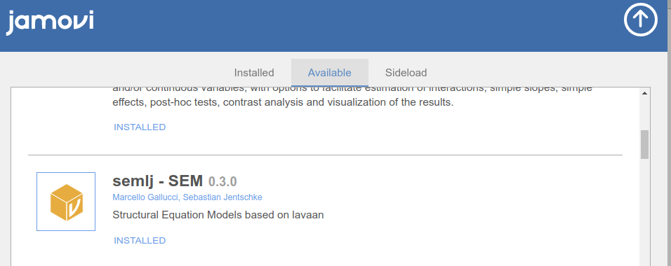

  
:::{ .root }
:::

```{r echo=FALSE,results='hide'}
library(mcdocs)
mcdocs_init()

```
  

Structural Equation Models for jamovi based on R package lavaan


:::{ .adm .adm-seealso}
# Main Sub-Modules

`r modulename()` is composed of two sub-modules, please visit the sub-module page for more info.

* [SEMLj (interactive)](gui.html) for point-and-click user interface
* [SEMLj (syntax)](syntax.html) for lavaan style model definition

:::

`r include_examples()`


# Installation

## In jamovi




## Install in R

To install it in R, simply use:

```

devtools::install_github("semlj/semlj")

```

# Release notes

Please check out the  [Release notes](release_notes.html). 

# Quality control

Please check the [rosetta store](rosetta.html) for alignment with other software results and possible discrepancies.

  
`r issues()`

